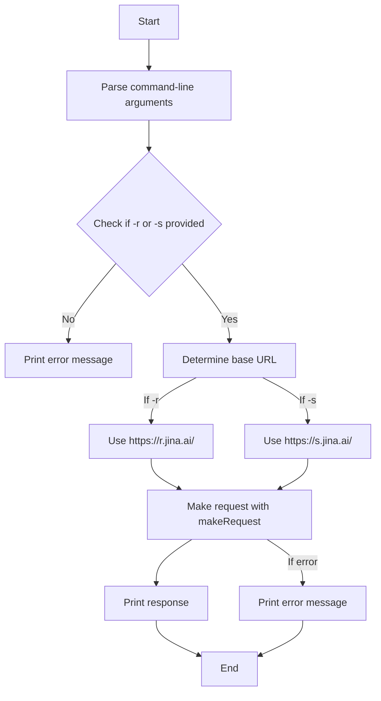

# README.md

## Example Usage:
**Reader**
```
jina on  jina-tool via 🐹 v1.22.2 
❯ jina -r https://example.com
Title: Example Domain

URL Source: https://example.com/

Markdown Content:
This domain is for use in illustrative examples in documents. You may use this domain in literature without prior coordination or asking for permission.

[More information...](https://www.iana.org/domains/example)
```
**Search** Will return the top 5 articles.
```
jina on  jina-tool via 🐹 v1.22.2
❯ jina -s "What is fabric by Daniel Miessler?"
[1] Title: GitHub - danielmiessler/fabric: fabric is an open-source framework for augmenting humans using AI. It provid
es a modular framework for solving specific problems using a crowdsourced set of AI prompts that can be used anywhere.
[1] URL Source: https://github.com/danielmiessler/fabric
[1] Description: fabric is <strong>an open-source framework for augmenting humans using AI</strong>. It provides a modu
lar framework for solving specific problems using a crowdsourced set of AI prompts that can be used anywhere. - danielm
iessler/fabric
[1] Markdown Content:
[](https://github.c
om/danielmiessler/fabric/blob/main/images/fabric-logo-gif.gif)

`fabric`
------------
<-- SNIP -->
------------
[2] Title: Why I Created Fabric
[2] URL Source: https://danielmiessler.com/p/fabric-origin-story
[2] Description: An overview of the AI workflows I built in 2023, and what became the <strong>Fabric</strong> project.
[2] Markdown Content:
Why I Created Fabric
===============
------------
<-- SNIP -->
------------
```
## Overview

This Go program is a simple command-line tool that makes HTTP GET requests to `https://r.jina.ai/` or `https://s.jina.ai/` URLs based on user input. It allows users to either provide a read URL or a search input string, which is then appended to a predefined base URL and sent as a request. The program fetches the response from the server and prints it to the console.

## Contents

The main components of the program include:

1. **Imports**: The program imports necessary packages such as `flag`, `fmt`, `io`, and `net/http` for command-line argument parsing, formatted I/O operations, reading from the response body, and making HTTP requests, respectively.

2. **makeRequest function**: 
   - This function takes a URL and an input string as arguments.
   - It constructs the full request URL and performs an HTTP GET request.
   - It handles errors during the request and response reading process.
   - The function returns the response body as a string or an error if any occurred.

3. **main function**: 
   - It parses command-line arguments using the `flag` package to get the `-r` (read URL) and `-s` (search input) parameters.
   - It checks if at least one of the parameters is provided.
   - Based on the provided arguments, it determines the appropriate base URL (`https://r.jina.ai/` for read URL and `https://s.jina.ai/` for search input).
   - It calls the `makeRequest` function and prints the response or any errors encountered.

## Usage

To run the program, you can use the following commands in your terminal:

- For providing a read URL:
  ```
  go run main.go -r <your_read_url>
  ```

- For providing a search input:
  ```
  go run main.go -s <your_search_input>
  ```

Make sure to replace `<your_read_url>` or `<your_search_input>` with actual values.

**Building:** You can build the file with `go build -o jina main.go`. This will build the binary and name it 'jina'. Once it is built you can move it to your `/home/user/go/bin/` directory to call it like you would fabric.

## Flowchart

The following flowchart illustrates the flow of the program:



